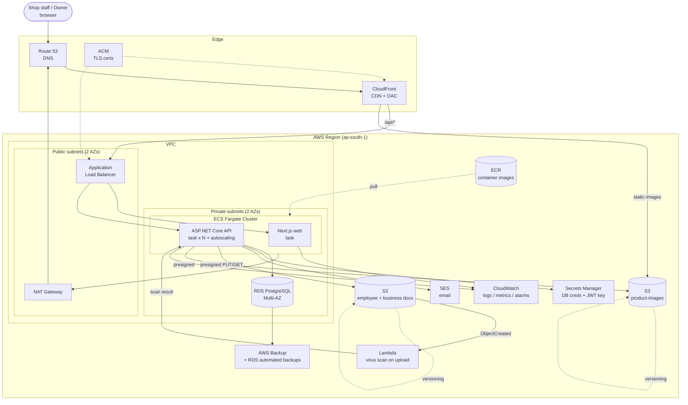

# AWS Architecture

Production topology for RBMS on AWS. Provisioned via Terraform (`infra/terraform/`),
deployed via GitHub Actions (`.github/workflows/`).

## Component responsibilities

| Component | Role | Notes |
|---|---|---|
| **Route 53** | DNS | apex + `api.` / `app.` records |
| **CloudFront** | CDN, TLS termination at edge | OAC to S3 image bucket; `/api/*` behavior → ALB |
| **ACM** | Certificates | one in `us-east-1` for CloudFront, one in region for ALB |
| **ALB** | L7 load balancing, health checks | path routing `/` → web, `/api` → API; HTTPS only |
| **ECS Fargate** | Serverless containers | API service autoscales on CPU/req; web service fixed small |
| **RDS PostgreSQL** | Primary datastore | Multi-AZ, encrypted at rest (KMS), PITR enabled |
| **ECR** | Image registry | API + web images, scanned on push |
| **S3 (images)** | Product images | private, served only via CloudFront OAC |
| **S3 (documents)** | Employee/business/supplier docs | private, presigned URLs, versioned, SSE-KMS |
| **Lambda (scan)** | Virus scanning | triggered on upload; quarantine on infection |
| **SES** | Transactional email | low-stock, salary-due, expiry, backup-failure alerts |
| **Secrets Manager** | Secrets | DB connection, JWT signing key; rotation enabled |
| **CloudWatch** | Observability | structured logs, metrics, alarms → SNS |
| **AWS Backup** | DR | RDS automated backups + cross-service backup plan; S3 versioning |

## Network security posture

- RDS lives in **private** subnets; its security group only accepts `5432` from the ECS
  task security group. No public IP.
- ECS tasks have **no public IP**; egress via NAT for pulling images / calling AWS APIs.
- ALB is the only ingress; security group allows `443` from CloudFront prefix list only.
- S3 buckets **block all public access**; access is exclusively via CloudFront OAC
  (images) or short-lived presigned URLs (documents).
- All inter-service traffic stays within the VPC; secrets are injected at runtime from
  Secrets Manager, never baked into images or env files.

## Scaling & HA

- **Multi-AZ** across two Availability Zones for ALB, ECS tasks, and RDS standby.
- ECS API service **target-tracking autoscaling** on CPU (and optionally ALB
  request-count-per-target).
- RDS read replica can be added in Phase 3 for reporting/analytics offload.
- Stateless API tasks → horizontal scale-out is safe (JWT, no server session state).
