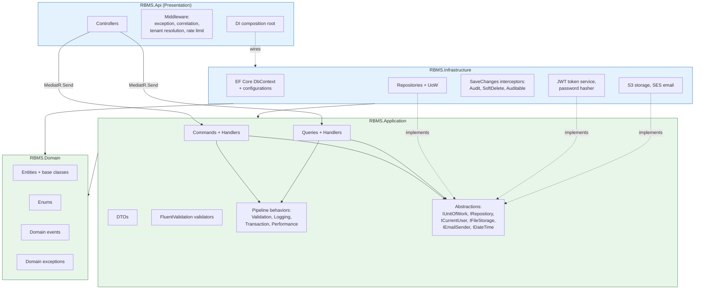

# Backend — Clean Architecture & CQRS



## Dependency rule

Dependencies point **inward**. `Domain` depends on nothing. `Application` depends only on
`Domain` and defines **interfaces** for everything it needs from the outside world
(persistence, storage, email, clock, current-user). `Infrastructure` and `Api` are the
outer ring — they depend inward and provide the **implementations** at runtime via DI.
This keeps business logic testable without a database, AWS, or HTTP.

## Request lifecycle (CQRS via MediatR)

```
HTTP request
  → Middleware (correlation id, tenant resolution, auth, rate limit)
  → Controller → mediator.Send(command/query)
  → Pipeline behaviors, in order:
        1. RequestLogging   (structured log + timing)
        2. Validation       (FluentValidation; throws ValidationException → 400)
        3. UnitOfWorkTransaction (commands only: open txn, commit/rollback)
  → Handler (the business logic)
        → repositories / domain entities
        → IUnitOfWork.SaveChangesAsync()
              → interceptors fire: set audit columns, convert deletes to soft-delete,
                emit audit_logs rows with old/new values
  → Result DTO → Controller → HTTP response
```

## Why these patterns

- **CQRS** separates write concerns (validation, transactions, side-effects) from read
  concerns (projections, no tracking, tailored DTOs). Reads can later move to a replica.
- **Repository + Unit of Work** wrap EF Core so handlers express intent
  (`_uow.Products.Add(...)`, `await _uow.SaveChangesAsync()`) and so the write-side is
  swappable and mockable in unit tests.
- **Pipeline behaviors** make validation/logging/transactions cross-cutting instead of
  copy-pasted into every handler.
- **Interceptors** enforce audit logging, soft delete, and tenant stamping at the
  persistence boundary so no handler can forget them.

## Project references

```
RBMS.Domain          → (none)
RBMS.Application      → RBMS.Domain
RBMS.Infrastructure   → RBMS.Application, RBMS.Domain
RBMS.Api             → RBMS.Application, RBMS.Infrastructure
RBMS.UnitTests        → RBMS.Application, RBMS.Domain
RBMS.IntegrationTests → RBMS.Api
```
