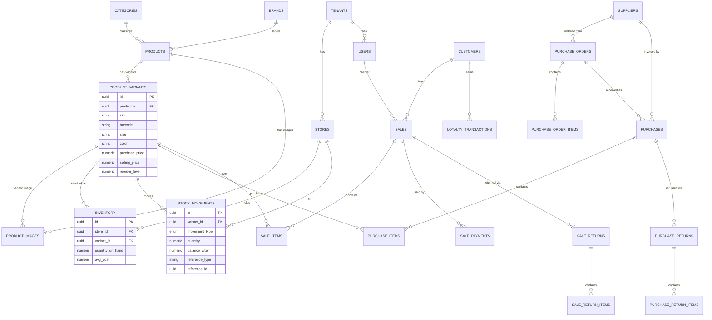
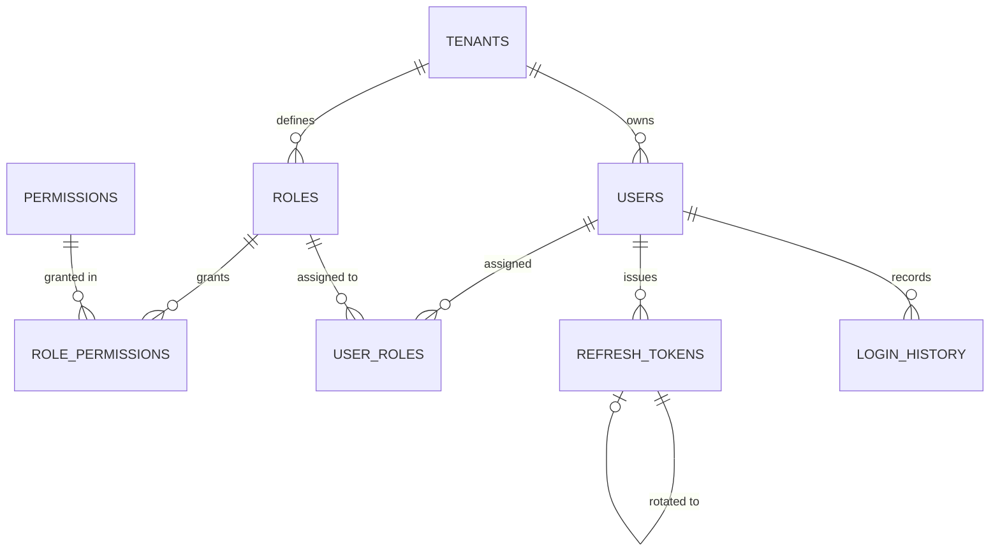
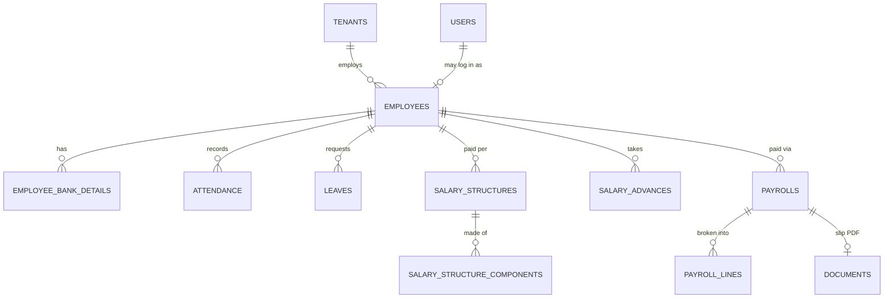
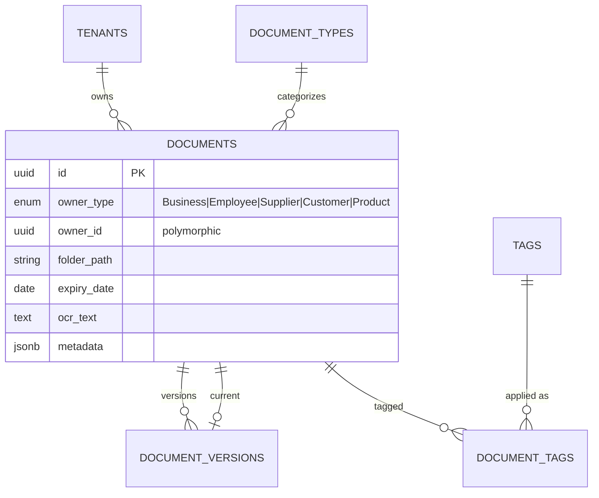

# Entity-Relationship Diagram

Derived from [`docs/database/schema.sql`](../database/schema.sql). Cross-cutting columns
(`tenant_id`, audit, soft-delete) are omitted from the diagram for readability — every
business table carries them.

## Core domain (Products → Inventory → Purchase → Sales)

## Security & multi-tenancy

## People & payroll

## Documents (polymorphic owner)

> **Polymorphic ownership:** `documents.owner_type` + `owner_id` lets one document store
> serve business certificates, employee paperwork, supplier files, and product assets
> without separate tables. Application code resolves `owner_id` per `owner_type`.
